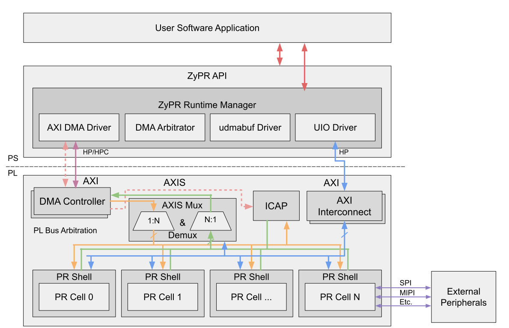

# ZyPR

ZyPR is an end-to-end build and runtime tool for Xilinx SoCs, written in Python.
This repo contains the code and documentation for the ZyPR project enabling high level design of partially reconfigured systems on AMD/Xilinx Zynq UltraScale+ FPGA SoCs.

## Motivation

Partial reconfiguration (PR) is a key enabler to the design and development of adaptive systems on modern Field Programmable Gate Array (FPGA) Systems-on-Chip (SoCs), allowing hardware to be adapted dynamically at runtime.
Vendor supported PR infrastructure is performance limited and blocking, drivers entail complex memory management, and software/hardware design requires bespoke knowledge of the underlying hardware.



This project presents a complete end-to-end framework that provides high performance reconfiguration of hardware from within a software abstraction in the Linux userspace, automating the process of building PR applications, with support for the Xilinx Zynq and Zynq UltraScale+ architectures, aimed at enabling non-expert application designers to leverage PR for edge applications.
We compare this framework against traditional vendor tooling for PR management as well as recent open source tools that support PR under Linux.
The framework provides a high performance runtime along with low overhead for its provided abstractions.

We introduce improvements to our previous work, increasing the provisioning throughput for PR bitstreams on the Zynq Ultrascale+ by ~2$\times$ and ~5.4$\times$ compared to Xilinx's FPGA Manager.

## Requirements

- Xilinx Vivado/Vitis (tested with 2019.2)
- Xilinx PetaLinux (tested with 2019.2)
- Board Files for your device type (tested with Ultra96v2)
- Python 3.10.0+
- Docker (v20.10.7+)

> note: Ensure the tools (`vivado`,`vitis`,`petalinux`) are available on your default shell, e.g. `bash`, `zsh`

## Installation

```bash
git clone git@github.com:accl-kaust/zypr.git --recursive
cd ZyPR2
pip install -e . dependencies
cd ZyPR/interfacer
pip install -e .
```

## Getting started

To get started, take a look at the `vision.json` config file, in the demo section to better understand how to construct your configuration file, referred to here as `config.json`.
Place your accelerator logic and `config.json` into your target build directory and follow the commands below:

```bash
cp $accelerator_logic/*.v .
zypr -v run -c config.json
```

> note: You can use the `--fpga` and `--linux` flags in the command line interface to specify **only** bitstream or petalinux building respectively. This useful if you only want to change the accelerator or the linux image.

## Building the docs

```bash
zypr docs
```

> note: Comprehensive documentation is still under construction. To see more options run `zypr --help`

## References

This framework uses/borrows from the following libraries:

- [FuseSoC](https://github.com/olofk/fusesoc) - Package Manager for HDLs
- [Edalize](https://github.com/olofk/edalize) - Python Library for interacting with EDA tools
- [FOS](https://github.com/FPGA-Research-Manchester/fos) - PR Build tool and Runtime Management Suite
- [udmabuf](https://github.com/ikwzm/udmabuf) - Linux device driver that allocates contiguous memory blocks available in the user space
